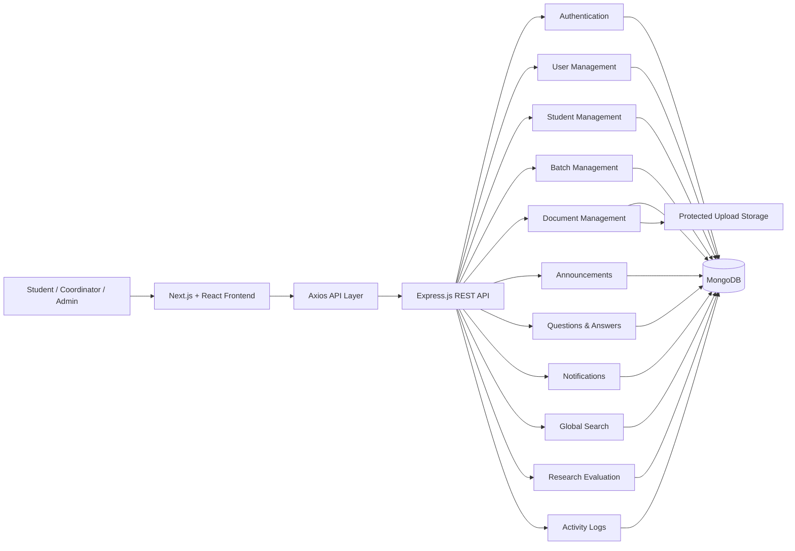
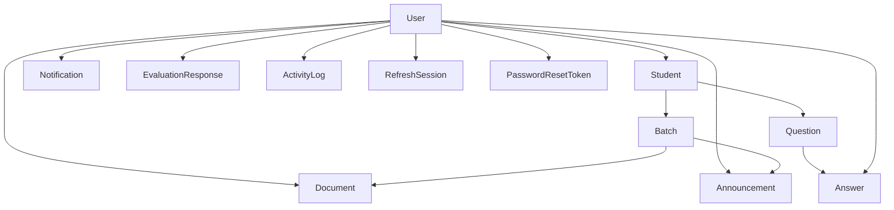
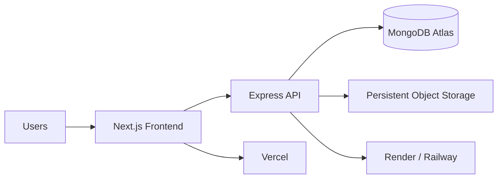

<div align="center">

  <!-- Rectangular Dark Navy Gradient Header Banner -->
  

  <!-- High-Performance Cyan Monospace Subtitle -->
  <a href="https://github.com/asam0816/Industrial-Training-Management-System-ITMS">
    
  </a>

  <br/><br/>

  <!-- Action Buttons -->
  <a href="https://github.com/asam0816/Industrial-Training-Management-System-ITMS" target="_blank">
    
  </a>
  <a href="https://asamofficial-portfolio.vercel.app/" target="_blank">
    
  </a>
  <a href="https://www.linkedin.com/in/asamofficial16" target="_blank">
    
  </a>

  <br/><br/>

  <!-- Tech Stack -->
  
  
  
  

  <br/><br/>

  <!-- Metadata Status Badges -->
  
  
  
  

</div>

---

# 🎓 Industrial Training Management System — ITMS

**Industrial Training Management System (ITMS)** is a full-stack web-based platform developed to centralize and streamline the management of university **Industrial Training / Internship activities**.

The system was developed as a **Software Engineering research project** based on the study:

> **A Web-Based Industrial Training Management System: A Case Study of the School of Computing**

The primary objective is to replace fragmented industrial-training communication and information management with one secure, organized and accessible digital platform.

Instead of students and coordinators depending on multiple independent channels such as:

```text
WhatsApp
   +
Email
   +
Google Drive
   +
GitHub
   +
Printed Documents
```

ITMS introduces:

```text
              ITMS
                │
        Centralized Platform
                │
     ┌──────────┼──────────┐
     ↓          ↓          ↓
  Students  Coordinators  Admins
```

All authorized users can access the relevant training information through a single system.

---

# 🔬 Research Background

Industrial training is an important component of university education because it connects academic knowledge with practical industry experience.

However, when internship information is distributed across different platforms, several problems can occur:

* Students may not know where official information is located
* Outdated documents may continue to circulate
* Important announcements may be missed
* Coordinators repeatedly answer the same questions
* Training documents become difficult to organize
* Communication becomes fragmented
* Administrative monitoring becomes more difficult
* Students may have difficulty identifying the latest forms and guidelines

ITMS addresses these problems through a **centralized web-based information and management platform**.

---

# 🎯 Research Objectives

The system is designed to:

* Centralize industrial training information
* Improve student access to official documents
* Reduce dependency on multiple communication platforms
* Improve communication between students and coordinators
* Reduce repetitive administrative work
* Provide structured document management
* Support targeted announcements
* Provide a centralized Question & Answer facility
* Improve student and batch management
* Provide system-wide activity monitoring
* Support usability and research evaluation
* Improve the overall efficiency of industrial training administration

---

# 👥 System Users

ITMS implements three primary system roles:

<div align="center">

```text
┌──────────────────────┐
│    ADMINISTRATOR     │
└──────────┬───────────┘
           │
           │ manages system
           ↓
┌──────────────────────┐
│ TRAINING COORDINATOR │
└──────────┬───────────┘
           │
           │ manages training
           ↓
┌──────────────────────┐
│       STUDENT        │
└──────────────────────┘
```

</div>

---

# 👑 Administrator

Administrators have system-wide management privileges.

### Administrator Capabilities

* View Admin Dashboard
* Manage system users
* Create users
* Edit users
* Change user account status
* Reset user passwords
* Manage students
* Create student accounts
* Edit student records
* Remove student records
* Manage training batches
* Create batches
* Edit batches
* Archive/delete batches
* Manage document categories
* Manage documents
* Publish announcements
* Manage student questions
* Review FAQs
* View evaluation analytics
* Export evaluation results
* View activity logs
* Manage profile information
* Access global search

---

# 🧑‍🏫 Training Coordinator

Training Coordinators manage the operational side of industrial training.

### Coordinator Capabilities

* View Coordinator Dashboard
* View students
* Search students
* View training batches
* Upload training documents
* Edit training documents
* Replace documents
* Publish/unpublish documents
* Delete documents
* Create announcements
* Update announcements
* Publish announcements
* Review student questions
* Answer student questions
* Resolve questions
* Reopen questions
* Mark questions as FAQs
* View notifications
* Submit research evaluation
* Manage profile
* Use global search

---

# 🎓 Student

Students receive a focused self-service industrial training portal.

### Student Capabilities

* Secure login
* View personalized dashboard
* View training status
* View assigned batch
* Access authorized documents
* Download training forms
* Search documents
* View announcements
* Submit questions
* View coordinator answers
* Browse Frequently Asked Questions
* Receive notifications
* Submit research evaluation
* View/update profile
* Change password
* Access security settings
* Use global search

---

# 🏠 Role-Based Dashboard System

ITMS displays different dashboards depending on the authenticated user's role.

```text
Login
  │
  ↓
Authentication
  │
  ↓
Role Detection
  │
  ├──────────── ADMIN ────────────→ Admin Dashboard
  │
  ├──────── COORDINATOR ─────────→ Coordinator Dashboard
  │
  └────────── STUDENT ───────────→ Student Dashboard
```

---

# 📊 Administrator Dashboard

The Admin Dashboard provides a system-wide overview.

### Dashboard Statistics

```text
Total Users
Total Students
Active Batches
Documents
Announcements
Open Questions
```

It also provides:

* Students-by-batch analytics
* Recent system activity
* Visual charts
* Administrative overview

The dashboard uses **Recharts** for data visualization.

---

# 🧑‍🏫 Coordinator Dashboard

The Coordinator Dashboard provides information relevant to day-to-day training management.

### Dashboard Statistics

* Total Students
* Active Batches
* Published Documents
* Announcements
* Open Questions

### Additional Information

* Recent student questions
* Question status
* Student information
* Training management shortcuts

---

# 🎓 Student Dashboard

Each student receives a personalized dashboard.

The dashboard displays:

```text
Student Name
Student Number
Programme
Training Batch
Training Status
```

### Student Statistics

* Available Announcements
* Available Documents
* Open Questions
* Answered Questions

It also displays:

* Recent Announcements
* Recent Documents
* Training status

---

# 👤 User Management

Administrators can manage application accounts through the User Management module.

### User Information

```text
Name
Email
Username
Phone
Role
Status
Last Login
```

### Supported Roles

```text
ADMIN
COORDINATOR
STUDENT
```

### User Account Status

```text
ACTIVE
INACTIVE
SUSPENDED
```

Inactive or suspended accounts cannot authenticate successfully.

---

# 🎓 Student Management

Student information is stored separately from general user-account information.

### Student Record

```text
User Account
Student Number
Registration Number
Programme
Training Batch
Academic Year
Phone
Address
Emergency Contact
Training Status
```

### Training Status Values

```text
NOT_STARTED
PREPARING
IN_PROGRESS
COMPLETED
ON_HOLD
```

This allows ITMS to track the student's progress through the industrial training lifecycle.

---

# 👥 Batch Management

Industrial training students can be grouped into dedicated training batches.

### Batch Information

```text
Batch Name
Batch Code
Programme
Academic Year
Start Date
End Date
Description
Status
```

### Batch Status

```text
ACTIVE
COMPLETED
ARCHIVED
```

Administrators can create and manage batches while coordinators can view batch information and assigned students.

---

# 📁 Document Management System

The Document Management module is one of the central components of ITMS.

Training staff can upload documents such as:

* Industrial training guidelines
* Application forms
* Training forms
* Report templates
* Evaluation forms
* Policies
* Official letters
* Notices
* Other training resources

---

# 📄 Document Information

Each document can contain:

```text
Title
Description
Category
Original Filename
Stored Filename
MIME Type
File Size
Version
Target Audience
Target Batches
Publication Status
Publication Date
Uploader
Tags
Download Count
```

---

# 🎯 Targeted Documents

Documents can be distributed to:

```text
ALL STUDENTS
```

or:

```text
SPECIFIC BATCHES
```

This prevents students from accessing documents that are not intended for their training group.

---

# 🔒 Protected Document Downloads

Training documents are **not simply exposed as public static files**.

The application uses an authenticated download endpoint:

```http
GET /api/documents/:id/download
```

Before returning the file, the backend verifies:

```text
Is the user authenticated?
        ↓
Is the document published?
        ↓
Is the student allowed to access it?
        ↓
Does the student's batch match?
        ↓
Does the physical file exist?
        ↓
Download Allowed
```

This provides better access control than publicly exposing uploaded files.

---

# 📤 Secure File Uploads

ITMS uses **Multer** for document uploads.

Supported file formats:

```text
PDF
DOC
DOCX
XLS
XLSX
```

Default maximum file size:

```text
10 MB
```

Uploaded files are stored using generated **UUID filenames** rather than trusting the original filename.

Example:

```text
Original:
Industrial_Training_Form.pdf

Stored:
8a601626-d533-4455-bdc8-aafb3785cfc6.pdf
```

This reduces filename collisions and makes file storage more predictable.

---

# 🗂️ Document Categories

Documents can be organized using categories.

Example categories included in the development seed:

```text
Guidelines
Application Forms
Training Forms
Report Templates
Evaluation Forms
Policies
Letters
Notices
Other
```

Administrators and coordinators can create and maintain document categories.

---

# 📢 Announcement Management

ITMS provides a centralized Announcement module for official training communication.

Announcements support:

```text
Title
Content
Priority
Target Audience
Target Batches
Publish Date
Expiration Date
Publication Status
Created By
Updated By
```

---

# 🚨 Announcement Priority

Supported priorities are:

```text
LOW
NORMAL
HIGH
URGENT
```

The frontend visually highlights high-priority and urgent announcements.

---

# 🎯 Targeted Announcements

Announcements can be published to:

```text
ALL
```

or:

```text
BATCH
```

Students therefore see communication relevant to their assigned training group.

---

# ❓ Question & Answer System

The Q&A module reduces repetitive communication between students and training coordinators.

### Student Workflow

```text
Student
   ↓
Submit Question
   ↓
Question = OPEN
   ↓
Coordinator / Admin Reviews
   ↓
Answer Submitted
   ↓
Student Notification
   ↓
Question = ANSWERED
   ↓
Resolve Question
```

---

# 📝 Question Information

Each question includes:

```text
Student
Subject
Message
Category
Status
Priority
FAQ Status
Resolved Date
```

### Question Status Values

```text
OPEN
ANSWERED
RESOLVED
CLOSED
```

### Question Priorities

```text
LOW
NORMAL
HIGH
URGENT
```

---

# 💬 Coordinator Answers

Administrators and coordinators can respond to student questions.

Each response stores:

```text
Question
Staff Member
Response
Timestamp
```

When a question receives an answer, the student receives a system notification.

---

# 📚 Frequently Asked Questions — FAQ

Useful student questions can be converted into publicly available FAQs.

```text
Student Question
      ↓
Coordinator Answer
      ↓
Mark as Public FAQ
      ↓
Available in FAQ Section
      ↓
Other Students Find Answer
```

This directly helps reduce repetitive questions to training coordinators.

---

# 🔔 Notification System

ITMS includes an internal notification system.

### Notification Types

```text
ANNOUNCEMENT
QUESTION_ANSWERED
DOCUMENT
SYSTEM
REMINDER
```

Users can:

* View notifications
* View unread count
* Mark individual notifications as read
* Mark all notifications as read

---

# 🔍 Global Search

ITMS contains a role-aware global search system.

### Student Search

Students can search:

```text
Documents
Announcements
FAQs
```

The results remain restricted by the student's access permissions.

### Coordinator Search

Coordinators can additionally search:

```text
Students
```

### Administrator Search

Administrators can additionally search:

```text
Users
Students
Documents
Announcements
FAQs
```

---

# 📋 Activity & Audit Logging

Important application operations can be recorded in the Activity Log.

Activity records contain:

```text
User
Action
Module
Description
Entity Type
Entity ID
IP Address
User Agent
Metadata
Timestamp
```

Example actions include:

```text
USER_LOGIN
USER_LOGOUT
CHANGE_PASSWORD
UPLOAD_DOCUMENT
UPDATE_DOCUMENT
DELETE_DOCUMENT
DOWNLOAD_DOCUMENT
SUBMIT_QUESTION
ANSWER_QUESTION
RESET_PASSWORD_REQUEST
```

Activity logs are restricted to administrators.

---

# 📊 Research Evaluation Module

ITMS includes a dedicated **research usability evaluation module**.

Students and coordinators can submit an evaluation once.

Each item is scored using a:

```text
1 → 5 Likert Scale
```

---

# 🧪 Evaluation Criteria

The current evaluation contains nine research measures:

```text
1. Usefulness

2. Ease of Use

3. Ease of Learning

4. Information Easy to Find

5. Document Management Convenience

6. Announcement Process Clarity

7. Q&A Process Usefulness

8. Reduction of Multiple Communication Channels

9. Overall Satisfaction
```

Respondents can also submit written comments.

---

# 📈 Evaluation Analytics

Administrators can access:

* Total number of respondents
* Average score for each evaluation criterion
* Responses grouped by role
* Evaluation analytics

Evaluation data can also be exported as:

```text
CSV
```

This makes the module suitable for analyzing results as part of the research evaluation chapter.

---

# 🔐 Authentication System

ITMS implements secure authentication using:

```text
Email / Username / Student Number
             +
          Password
             ↓
           bcrypt
             ↓
        Authentication
             ↓
      Access JWT Token
             +
      Refresh JWT Token
             ↓
      HTTP-Only Cookies
```

---

# 🔑 Multiple Login Identifiers

A user can authenticate using:

* Email
* Username

Students may also be resolved through their:

```text
Student Number
```

This improves usability while maintaining the same centralized authentication service.

---

# 🍪 HTTP-Only Authentication Cookies

Access and refresh tokens are stored in **HTTP-only cookies**.

```text
accessToken
refreshToken
```

JavaScript running in the browser cannot directly read HTTP-only cookies.

Production cookie configuration supports:

```text
Secure = true
SameSite = none
```

when HTTPS cross-site deployment requires it.

---

# 🔄 Refresh Token Rotation

The backend stores refresh sessions separately in MongoDB.

Each refresh token has a unique:

```text
jti
```

identifier.

When refreshing a session:

```text
Current Refresh Token
        ↓
Validate JWT
        ↓
Find Refresh Session
        ↓
Revoke Old Session
        ↓
Generate New Access Token
        ↓
Generate New Refresh Token
        ↓
Store New Refresh Session
```

This implements refresh-session rotation.

---

# 🚪 Logout

During logout:

```text
Refresh Session
      ↓
Revoked
      ↓
Authentication Cookies
      ↓
Cleared
```

The logout operation is also recorded in the activity log.

---

# 🔑 Password Security

User passwords are never stored as plaintext.

The application uses:

```text
bcrypt
```

with password hashing before database storage.

Password hashes are excluded from normal User API responses.

---

# 🔐 Strong Password Validation

Password changes and resets require:

```text
Minimum 8 Characters
        +
Uppercase Character
        +
Lowercase Character
        +
Number
```

---

# 🔁 Forgot Password

The password recovery workflow is:

```text
Forgot Password
       ↓
Submit Email
       ↓
Generic Response
       ↓
Generate 32-byte Random Token
       ↓
SHA-256 Hash
       ↓
Store Hashed Token
       ↓
Expiration Time
       ↓
Reset Password
```

Only the hash of the reset token is stored in MongoDB.

---

# ⏳ Password Reset Expiration

The expiration period is configurable using:

```env
PASSWORD_RESET_EXPIRES_MINUTES=30
```

The token is single-use and records when it has been consumed.

---

# 🛡️ Role-Based Access Control — RBAC

Backend authorization is enforced by Express middleware.

```text
Request
  ↓
authenticate()
  ↓
JWT Validation
  ↓
Load User
  ↓
Check Account Status
  ↓
authorize(...)
  ↓
Role Permission
  ↓
Controller
```

Frontend navigation visibility is therefore **not treated as the security boundary**.

---

# 🚦 Authentication Rate Limiting

Sensitive authentication endpoints use rate limiting.

Production configuration limits repeated authentication attempts within a defined window, helping reduce brute-force abuse.

---

# 🪖 Security Headers

The Express backend uses:

```text
Helmet
```

to add HTTP security headers.

---

# 🌐 CORS Protection

Cross-origin requests are restricted using:

```env
CLIENT_URL
```

and credentials are explicitly enabled for authentication cookies.

---

# 📦 Request Size Protection

JSON and form bodies are limited to:

```text
1 MB
```

reducing exposure to oversized request payloads.

---

# ✅ Input Validation

The application uses:

```text
Zod
```

for request validation, including authentication forms and important API input.

---

# 🧱 System Architecture



---

# 🔄 Application Data Flow

```text
Next.js Page
      ↓
React Component
      ↓
Axios
      ↓
Express REST API
      ↓
Middleware
      ↓
Controller
      ↓
Mongoose
      ↓
MongoDB
```

---

# 💻 Technology Stack

## 🎨 Frontend

<p>

</p>

| Technology          | Purpose                        |
| ------------------- | ------------------------------ |
| **Next.js 15**      | React application framework    |
| **React 19**        | Component-based user interface |
| **JavaScript**      | Frontend application logic     |
| **CSS3**            | Custom responsive styling      |
| **Axios**           | REST API communication         |
| **React Hook Form** | Form handling                  |
| **Zod**             | Form and data validation       |
| **Lucide React**    | Interface icons                |
| **Recharts**        | Dashboard charts               |
| **Sonner**          | Toast notifications            |

---

# ⚙️ Backend

<p>

</p>

| Technology             | Purpose                      |
| ---------------------- | ---------------------------- |
| **Node.js**            | Backend runtime              |
| **Express.js 5**       | REST API framework           |
| **MongoDB**            | NoSQL database               |
| **Mongoose**           | MongoDB ODM                  |
| **bcrypt**             | Password hashing             |
| **jsonwebtoken**       | Access and refresh JWTs      |
| **cookie-parser**      | Authentication cookies       |
| **Helmet**             | Security headers             |
| **CORS**               | Cross-origin access control  |
| **express-rate-limit** | Authentication rate limiting |
| **Multer**             | Protected file uploads       |
| **UUID**               | Safe generated filenames     |
| **Morgan**             | HTTP request logging         |
| **Zod**                | Backend validation           |

---

# 🧪 Testing

<p>

</p>

The backend includes:

```text
Jest
Supertest
```

A base API health test is included and can be extended for:

* Authentication testing
* Authorization testing
* Document permissions
* Student access controls
* Q&A testing
* Evaluation testing
* Security testing

---

# 🗄️ Database Models

The current backend contains the following main MongoDB models:

```text
User
Student
Batch
Document
DocumentCategory
Announcement
Question
Answer
Notification
EvaluationResponse
ActivityLog
RefreshSession
PasswordResetToken
```

---

# 🗃️ Database Relationships



---

# 📁 Project Structure

```text
Industrial-Training-Management-System-ITMS/
│
├── client/
│   │
│   ├── app/
│   │   │
│   │   ├── admin/
│   │   │   ├── dashboard/
│   │   │   ├── users/
│   │   │   ├── students/
│   │   │   ├── batches/
│   │   │   ├── documents/
│   │   │   ├── document-categories/
│   │   │   ├── announcements/
│   │   │   ├── questions/
│   │   │   ├── evaluation/
│   │   │   ├── activity-logs/
│   │   │   ├── profile/
│   │   │   └── settings/
│   │   │
│   │   ├── coordinator/
│   │   │   ├── dashboard/
│   │   │   ├── students/
│   │   │   ├── batches/
│   │   │   ├── documents/
│   │   │   ├── announcements/
│   │   │   ├── questions/
│   │   │   └── profile/
│   │   │
│   │   ├── student/
│   │   │   ├── dashboard/
│   │   │   ├── documents/
│   │   │   ├── announcements/
│   │   │   ├── questions/
│   │   │   ├── faq/
│   │   │   └── profile/
│   │   │
│   │   ├── login/
│   │   ├── forgot-password/
│   │   ├── reset-password/
│   │   ├── change-password/
│   │   ├── notifications/
│   │   ├── evaluation/
│   │   ├── search/
│   │   ├── settings/
│   │   ├── unauthorized/
│   │   ├── layout.js
│   │   └── globals.css
│   │
│   ├── components/
│   │   ├── AnnouncementsPage.js
│   │   ├── AppShell.js
│   │   ├── BatchesPage.js
│   │   ├── DataTable.js
│   │   ├── DocumentsPage.js
│   │   ├── Loading.js
│   │   ├── Modal.js
│   │   ├── PageHeader.js
│   │   ├── Pagination.js
│   │   ├── ProfilePage.js
│   │   ├── QuestionsPage.js
│   │   ├── RoleGuard.js
│   │   ├── StatCard.js
│   │   ├── StatusBadge.js
│   │   └── StudentsPage.js
│   │
│   ├── context/
│   │   └── AuthContext.js
│   │
│   ├── services/
│   │   └── api.js
│   │
│   ├── utils/
│   │   └── format.js
│   │
│   ├── package.json
│   └── next.config.mjs
│
├── server/
│   │
│   ├── src/
│   │   │
│   │   ├── config/
│   │   │   ├── db.js
│   │   │   └── env.js
│   │   │
│   │   ├── controllers/
│   │   │   ├── activityController.js
│   │   │   ├── announcementController.js
│   │   │   ├── authController.js
│   │   │   ├── batchController.js
│   │   │   ├── categoryController.js
│   │   │   ├── dashboardController.js
│   │   │   ├── documentController.js
│   │   │   ├── evaluationController.js
│   │   │   ├── notificationController.js
│   │   │   ├── profileController.js
│   │   │   ├── questionController.js
│   │   │   ├── searchController.js
│   │   │   ├── studentController.js
│   │   │   └── userController.js
│   │   │
│   │   ├── middleware/
│   │   │   ├── auth.js
│   │   │   ├── authorize.js
│   │   │   ├── error.js
│   │   │   ├── rateLimit.js
│   │   │   ├── upload.js
│   │   │   └── validate.js
│   │   │
│   │   ├── models/
│   │   │   ├── ActivityLog.js
│   │   │   ├── Announcement.js
│   │   │   ├── Answer.js
│   │   │   ├── Batch.js
│   │   │   ├── Document.js
│   │   │   ├── DocumentCategory.js
│   │   │   ├── EvaluationResponse.js
│   │   │   ├── Notification.js
│   │   │   ├── PasswordResetToken.js
│   │   │   ├── Question.js
│   │   │   ├── RefreshSession.js
│   │   │   ├── Student.js
│   │   │   └── User.js
│   │   │
│   │   ├── routes/
│   │   ├── seed/
│   │   │   └── seed.js
│   │   ├── services/
│   │   ├── uploads/
│   │   ├── utils/
│   │   ├── validators/
│   │   ├── app.js
│   │   └── server.js
│   │
│   ├── tests/
│   │   └── health.test.js
│   │
│   ├── .env.example
│   ├── jest.config.js
│   └── package.json
│
├── package.json
├── .gitignore
├── README.md
└── # What is this Research.txt
```

---

# 🌐 Frontend Routes

## Public

```text
/
 /login
 /forgot-password
 /reset-password
 /change-password
```

---

## Administrator

```text
/admin/dashboard
/admin/users
/admin/students
/admin/batches
/admin/documents
/admin/document-categories
/admin/announcements
/admin/questions
/admin/evaluation
/admin/activity-logs
/admin/profile
/admin/settings
```

---

## Coordinator

```text
/coordinator/dashboard
/coordinator/students
/coordinator/batches
/coordinator/documents
/coordinator/announcements
/coordinator/questions
/coordinator/profile
```

---

## Student

```text
/student/dashboard
/student/documents
/student/announcements
/student/questions
/student/faq
/student/profile
```

---

## Shared Authenticated Pages

```text
/notifications
/evaluation
/search
/settings/security
```

---

# 🔌 REST API

Development base URL:

```text
http://localhost:5000/api
```

---

# ❤️ Health Check

```http
GET /api/health
```

Example response:

```json
{
  "success": true,
  "message": "ITMS API is running"
}
```

---

# 🔐 Authentication API

```http
POST  /api/auth/login
POST  /api/auth/refresh
POST  /api/auth/logout
GET   /api/auth/me

POST  /api/auth/forgot-password
POST  /api/auth/reset-password
PATCH /api/auth/change-password
```

---

# 👥 User Management API

Administrator only:

```http
GET   /api/users
POST  /api/users
GET   /api/users/:id
PATCH /api/users/:id
PATCH /api/users/:id/status
POST  /api/users/:id/reset-password
```

---

# 🎓 Student API

```http
GET    /api/students
POST   /api/students
GET    /api/students/:id
PATCH  /api/students/:id
DELETE /api/students/:id
```

Student creation, modification and deletion are restricted to administrators.

Administrators and coordinators can view students.

---

# 👨‍👩‍👧‍👦 Batch API

```http
GET    /api/batches
GET    /api/batches/:id
GET    /api/batches/:id/students

POST   /api/batches
PATCH  /api/batches/:id
DELETE /api/batches/:id
```

---

# 🗂️ Document Category API

```http
GET    /api/document-categories
POST   /api/document-categories
PATCH  /api/document-categories/:id
DELETE /api/document-categories/:id
```

---

# 📁 Document API

```http
GET    /api/documents
POST   /api/documents
GET    /api/documents/:id
PATCH  /api/documents/:id
DELETE /api/documents/:id

GET    /api/documents/:id/download
PATCH  /api/documents/:id/publish
```

---

# 📢 Announcement API

```http
GET    /api/announcements
POST   /api/announcements
GET    /api/announcements/:id
PATCH  /api/announcements/:id
DELETE /api/announcements/:id

PATCH  /api/announcements/:id/publish
```

---

# ❓ Question & Answer API

```http
GET   /api/questions
POST  /api/questions

GET   /api/questions/faq
GET   /api/questions/:id

PATCH /api/questions/:id
POST  /api/questions/:id/answers

PATCH /api/questions/:id/resolve
PATCH /api/questions/:id/reopen
PATCH /api/questions/:id/faq
```

---

# 🔔 Notification API

```http
GET   /api/notifications
GET   /api/notifications/unread-count

PATCH /api/notifications/read-all
PATCH /api/notifications/:id/read
```

---

# 📊 Dashboard API

```http
GET /api/dashboard/admin
GET /api/dashboard/coordinator
GET /api/dashboard/student
```

---

# 🧪 Evaluation API

```http
POST /api/evaluations
GET  /api/evaluations/me

GET  /api/evaluations/stats
GET  /api/evaluations/export
```

Evaluation statistics and export are restricted to administrators.

---

# 📜 Activity Log API

```http
GET /api/activity-logs
```

Administrator only.

---

# 👤 Profile API

```http
GET   /api/profile
PATCH /api/profile
```

---

# 🔍 Search API

```http
GET /api/search?q=searchTerm
```

Search results automatically vary according to the authenticated user's role.

---

# 🚀 Getting Started

## Prerequisites

Install:

```text
Node.js 20+
npm
MongoDB
Git
```

MongoDB can be either:

```text
MongoDB Community Server
```

or:

```text
MongoDB Atlas
```

---

# 1️⃣ Clone the Repository

```bash
git clone https://github.com/asam0816/Industrial-Training-Management-System-ITMS.git
```

Enter the project:

```bash
cd Industrial-Training-Management-System-ITMS
```

---

# 2️⃣ Install All Dependencies

The root project contains a helper command:

```bash
npm run install:all
```

Alternatively, dependencies can be installed manually.

### Root

```bash
npm install
```

### Client

```bash
cd client
npm install
```

### Server

```bash
cd ../server
npm install
```

---

# 3️⃣ Configure Backend Environment

Create:

```text
server/.env
```

using:

```text
server/.env.example
```

Example:

```env
PORT=5000
NODE_ENV=development

MONGODB_URI=mongodb://127.0.0.1:27017/itms

CLIENT_URL=http://localhost:3000

JWT_ACCESS_SECRET=replace_with_a_long_random_secret_at_least_32_characters
JWT_REFRESH_SECRET=replace_with_a_different_long_random_secret_at_least_32_characters

JWT_ACCESS_EXPIRES_IN=15m
JWT_REFRESH_EXPIRES_IN=7d

COOKIE_SECURE=false

UPLOAD_DIR=src/uploads
MAX_FILE_SIZE_MB=10

PASSWORD_RESET_EXPIRES_MINUTES=30
```

> Never commit your real `.env` file or production secrets to GitHub.

---

# 4️⃣ Configure Frontend Environment

Create:

```text
client/.env.local
```

using:

```text
client/.env.local.example
```

Add:

```env
NEXT_PUBLIC_API_URL=http://localhost:5000/api
```

---

# 5️⃣ Start MongoDB

For local development, the default database URL is:

```text
mongodb://127.0.0.1:27017/itms
```

Make sure MongoDB is running before starting the backend.

---

# 6️⃣ Seed Development Data

From the project root:

```bash
npm run seed
```

or:

```bash
cd server
npm run seed
```

The development seed creates:

```text
1 Administrator
2 Coordinators
3 Training Batches
18 Students
Document Categories
Sample Training Document
Sample Announcement
Sample Question / Answer
Notification
Activity Log
```

> The seed data contains development-only accounts and should never be treated as production credentials.

---

# 7️⃣ Run Full Application

From the root:

```bash
npm run dev
```

This starts both:

```text
Next.js Client
       +
Express Server
```

using `concurrently`.

---

# ▶️ Run Separately

### Client

```bash
npm run client
```

or:

```bash
cd client
npm run dev
```

Frontend:

```text
http://localhost:3000
```

### Backend

```bash
npm run server
```

or:

```bash
cd server
npm run dev
```

Backend:

```text
http://localhost:5000
```

---

# 🏗️ Production Build

Build the Next.js frontend:

```bash
npm run build
```

or:

```bash
cd client
npm run build
```

---

# 🧪 Run Tests

```bash
npm test
```

or:

```bash
cd server
npm test
```

---

# 📜 Root Scripts

| Command               | Description                                  |
| --------------------- | -------------------------------------------- |
| `npm run install:all` | Install root, client and server dependencies |
| `npm run dev`         | Run frontend and backend together            |
| `npm run client`      | Run Next.js frontend                         |
| `npm run server`      | Run Express backend                          |
| `npm run seed`        | Seed MongoDB                                 |
| `npm test`            | Run backend tests                            |
| `npm run build`       | Build Next.js frontend                       |

---

# 🔒 Security Summary

<div align="center">


<br/>


<br/>


<br/>


</div>

---

# 🛡️ Implemented Security Controls

```text
bcrypt Password Hashing
        ↓
Access + Refresh JWT
        ↓
HTTP-Only Cookies
        ↓
Refresh Session Rotation
        ↓
Role-Based Authorization
        ↓
Account Status Validation
        ↓
Authentication Rate Limiting
        ↓
Helmet Security Headers
        ↓
Restricted CORS
        ↓
Request Validation
        ↓
File Type Validation
        ↓
File Size Validation
        ↓
UUID Filenames
        ↓
Protected Downloads
        ↓
Audit Logging
```

---

# ☁️ Production Deployment Architecture

A suitable production deployment architecture is:



### Recommended Services

```text
Frontend
   → Vercel

Backend
   → Render / Railway

Database
   → MongoDB Atlas

Production Documents
   → S3-Compatible Object Storage
```

Local filesystem storage is appropriate for development, but persistent object storage is recommended for a real production deployment.

---

# 🌍 Production Environment

For deployment:

```env
NODE_ENV=production
COOKIE_SECURE=true
CLIENT_URL=https://your-production-frontend-domain.com
```

Also use:

* Strong randomly generated JWT secrets
* HTTPS
* Production MongoDB credentials
* Persistent document storage
* Restricted production CORS
* Secure environment-variable management

---

# 🔬 Research Evaluation Workflow

```text
Student / Coordinator
        ↓
Use ITMS
        ↓
Open Evaluation Module
        ↓
Score 9 Usability Questions
        ↓
Optional Comments
        ↓
Submit Once
        ↓
MongoDB
        ↓
Admin Evaluation Dashboard
        ↓
Average Scores
        +
Respondent Count
        +
Role Distribution
        ↓
CSV Export
        ↓
Research Analysis
```

---

# 📌 Research Contribution

The system demonstrates how a centralized digital platform can potentially improve the industrial training management process by bringing together:

```text
Student Management
        +
Batch Management
        +
Training Documents
        +
Announcements
        +
Questions & Answers
        +
Frequently Asked Questions
        +
Notifications
        +
Role-Based Dashboards
        +
Search
        +
Audit Logs
        +
Research Evaluation
```

within a single web application.

---

# 🔮 Future Enhancements

Potential future improvements include:

```text
Industry Supervisor Accounts
          ↓
Industry Partner Portal
          ↓
Training Placement Management
          ↓
Internship Company Database
          ↓
Supervisor Visit Scheduling
          ↓
Digital Logbook
          ↓
Weekly Progress Reports
          ↓
Student Report Submission
          ↓
Supervisor Evaluation
          ↓
Industry Evaluation
          ↓
Email Notifications
          ↓
Cloud Document Storage
          ↓
Advanced Analytics
          ↓
Mobile Application
```

---

# 👨‍💻 Developer

<div align="center">

## Mohamed Asam

### Software Engineer | Full Stack Developer

**Bachelor of Computer Science — Software Engineering Graduate**

**KAATSU International University**

<br/>

This project was developed as a practical software implementation focused on improving the organization, accessibility and management of university industrial training information.

My development interests include:

`Full Stack Development` • `MERN Applications` • `SaaS Platforms` • `ERP Systems` • `Authentication Systems` • `Software Security`

<br/>

<a href="https://asamofficial-portfolio.vercel.app/">
  
</a>

<a href="https://github.com/asam0816">
  
</a>

<a href="https://www.linkedin.com/in/asamofficial16">
  
</a>

<a href="mailto:asamofficial16@gmail.com">
  
</a>

</div>

---

# ⭐ Support

If you find this research project useful, consider giving the repository a **GitHub Star ⭐**.

<div align="center">

<a href="https://github.com/asam0816/Industrial-Training-Management-System-ITMS">
  
</a>

<a href="https://github.com/asam0816/Industrial-Training-Management-System-ITMS/fork">
  
</a>

</div>

---

<div align="center">

## 🎓 Centralize. Manage. Communicate. Improve.


<br/><br/>


<br/><br/>

**Final Year Software Engineering Research Project**

<br/>

### © 2026 Mohamed Asam

<br/>


</div>
